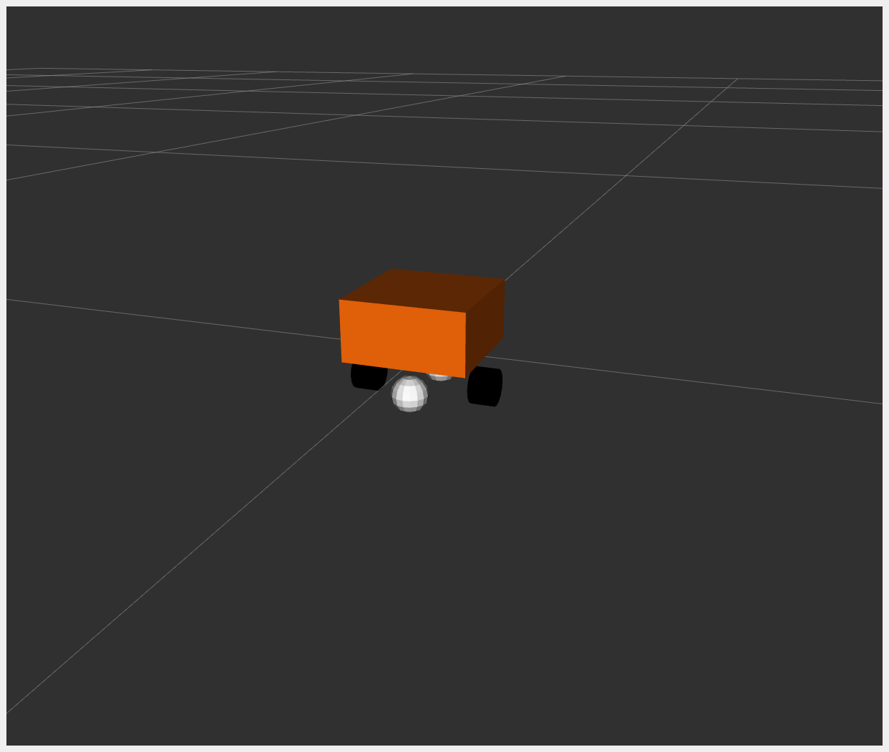

# diffbot_example

A differential-drive mobile robot simulation built on top of [ros2_control](https://control.ros.org/),
merging two open-source projects:

- **[ros2_control_demos](https://github.com/ros-controls/ros2_control_demos)** (`example_2` / DiffBot)
  — the `ros2_control` hardware-interface and `diff_drive_controller` plumbing.
- **[articubot_one](https://github.com/joshnewans/articubot_one)** — a real hobby-robot description
  (chassis, wheels, caster, lidar, RGB camera, depth camera), replacing the stock example's bare box.

On top of that base, this repo adds Gazebo Sim integration, a warehouse test environment, and a
reactive **teleop safety layer**: drive the robot manually, and it stops you before a collision,
waits, turns itself out of the way, then hands control back.



## Setup

The three upstream projects are vendored as pinned git submodules under `external/` (not built —
their files are copied/adapted into `description/`, `worlds/`, etc. — the submodules exist so the
exact upstream state this was built against is reproducible).

```bash
git clone --recurse-submodules <this-repo-url> diffbot_example
# or, if already cloned without --recurse-submodules:
git submodule update --init --recursive
```

Dependencies (ROS 2 Humble):

```bash
sudo apt install ros-humble-gz-ros2-control ros-humble-ros-gz-sim ros-humble-ros-gz-bridge \
                  ros-humble-teleop-twist-keyboard ros-humble-rqt-plot
```

This package also declares an `exec_depend` on `ros2_control_demo_example_2` and
`ros2_control_demo_description` (for the `diffbot_description.urdf.xacro`/materials it reuses) —
build those from a full clone of `ros2_control_demos` (branch `humble`) alongside this package,
or from the pinned copy under `external/ros2_control_demos`.

Build:

```bash
colcon build --packages-select diffbot_example --symlink-install
source install/setup.bash
```

## Quick start

```bash
# Warehouse world (default):
ros2 launch diffbot_example diffbot_gazebo_sim.launch.py

# Empty test world with two obstacles instead:
ros2 launch diffbot_example diffbot_gazebo_sim.launch.py world:=empty_sensors.sdf

# Headless, no GUI/RViz/plots:
ros2 launch diffbot_example diffbot_gazebo_sim.launch.py gui:=false enable_plots:=false
```

Drive it with the keyboard, in a separate terminal:

```bash
ros2 run teleop_twist_keyboard teleop_twist_keyboard --ros-args \
    -r cmd_vel:=/cmd_vel_teleop -p stamped:=true
```

**Note the topic**: publish to `/cmd_vel_teleop`, not the controller's `cmd_vel` directly. The
`teleop_safety_filter` node sits between the two — it relays your commands through to
`/diffbot_base_controller/cmd_vel`, but intercepts and clamps them near obstacles. Driving straight
into the controller bypasses the safety layer entirely.

## The teleop safety filter

`scripts/teleop_safety_filter.py`, always running as part of the main launch file:

1. **Relays** whatever you publish on `/cmd_vel_teleop` straight through to the controller.
2. **Clamps forward motion to zero** the moment something enters a forward cone within
   `stop_distance` (default 0.8 m) — turning and reversing still pass through untouched, so you
   can usually just steer yourself out.
3. If forward stays blocked continuously for `wait_time` (default 5.0 s), it briefly **takes over**:
   compares average lidar range on the left vs. right side, turns toward whichever is more open for
   `turn_angle_deg` (default 80°), then **hands control back** to teleop.

It also publishes `/forward_obstacle_distance` (`std_msgs/Float32`) — the live minimum range in
that forward cone — for monitoring or plotting.

Tunable via ROS parameters: `stop_distance`, `wait_time`, `turn_speed`, `turn_angle_deg`,
`forward_half_angle_deg`, `side_start_angle_deg`, `side_end_angle_deg`.

## Safe-spawn validation

The warehouse world's furniture leaves an irregular open floor area. `diffbot_gazebo_sim.launch.py`
validates `spawn_x`/`spawn_y`/`spawn_z` against a conservative safe envelope *before* Gazebo starts,
and refuses to launch if you ask for a pose outside it:

```bash
ros2 launch diffbot_example diffbot_gazebo_sim.launch.py spawn_x:=100.0
# [ERROR] Refusing to spawn robot outside the warehouse's open floor area: spawn_x=100.0 ...
```

The bounds are derived from the warehouse's actual model poses (see the comment above
`SPAWN_X_BOUNDS` in the launch file) but are approximate — based on model center poses, not exact
collision-mesh extents — so treat them as a coarse safety net, not a precise map.

## Live plots

With `enable_plots:=true` (the default), three `rqt_plot` windows launch automatically:

- **Trajectory**: `diffbot_base_controller/odom` x/y position.
- **Forward obstacle distance**: live `/forward_obstacle_distance` reading.
- **Odometry drift**: wheel odometry vs. `/ground_truth/odom` (Gazebo's exact simulated pose),
  overlaid — useful for seeing how much the (intentionally open-loop) odometry drifts over time.

## Sensors: adapted for Gazebo Sim, not copied as-is

`articubot_one`'s sensor xacros were written for classic Gazebo (`libgazebo_ros_camera.so`,
`libgazebo_ros_ray_sensor.so`, `<sensor type="ray">`). None of that runs under Gazebo Sim
(Ignition/`gz-sim`). Each sensor was rewritten to Gazebo Sim's native sensor types:

- **Lidar**: `type="ray"` → `type="gpu_lidar"`, with `<topic>` set explicitly.
- **Camera**: dropped the `libgazebo_ros_camera.so` plugin; uses `<optical_frame_id>` directly.
- **Depth camera**: `type="depth"` → `type="depth_camera"`. Also renamed its links/joints/frames
  from `camera_*` to `depth_camera_*` — the original file reused the RGB camera's names, which is
  fine in `articubot_one` (only one is ever active there) but collides once both run together.

Two Gazebo Sim quirks worth knowing if you touch this further:

1. **`CameraInfo` topic collision**: if two camera-type sensors both use a `<topic>` that doesn't
   end in `/image`, their auto-generated `CameraInfo` topics both land on the same flat
   `/camera_info` name. Fix: name the topic `.../image` (e.g. `camera/image`) and `CameraInfo`
   nests correctly under `.../camera_info`.
2. **`gpu_lidar`/`depth_camera` frame_id**: unlike the plain `camera` sensor type (which honors
   `<optical_frame_id>`), these two silently ignore any frame override and stamp messages with
   Gazebo's internal scoped entity name (e.g. `diffbot/base_link/laser`) instead of the URDF link
   name. Since `robot_state_publisher` only publishes the real URDF frames, RViz/tf2 can't place
   that data without help — fixed with two static identity transforms in
   `diffbot_gazebo_sim.launch.py` bridging the two naming schemes. This only holds because the
   spawned entity name is pinned to `diffbot` (`-allow_renaming false`); if you spawn under a
   different name, update the static transforms to match.

## GPU rendering

If Gazebo Sim feels laggy, check whether it's actually using your GPU. Some desktop sessions set
`LIBGL_ALWAYS_SOFTWARE=1`, which forces all OpenGL rendering onto the CPU (`llvmpipe`) even when a
usable GPU is present — the launch file overrides this back to `0`, but that only works if your
user account is actually in the `render`/`video` groups:

```bash
sudo usermod -aG render,video $USER   # then log out and back in
```

## Known limitations

- `AWS_WAREHOUSE_MODELS_PATH` in `diffbot_gazebo_sim.launch.py` is a hardcoded absolute path to
  the warehouse world's `models/` directory — it's a catkin-only package (no ament install space),
  so there's no `FindPackageShare` to resolve it automatically. Update the constant if your
  workspace isn't at `~/ros2_control_ws`.
- The bundled `aws_robomaker_warehouse_GroundB_01` model ships with a physically invalid inertia
  tensor (`Iyy` far exceeds `Ixx + Izz`, violating the triangle inequality every real rigid body
  must satisfy). Classic Gazebo never validated this; Gazebo Sim's sdformat validation rejects the
  whole world load over it. Fixed in the vendored copy, but a fresh, unmodified clone of the
  upstream `aws-robomaker-small-warehouse-world` repo will need the same fix re-applied to
  `models/aws_robomaker_warehouse_GroundB_01/model.sdf`'s `<iyy>` value (it's a static model, so
  the exact number doesn't matter — anything satisfying the triangle inequality works).
- Wheel odometry is `open_loop: true` — it integrates commanded velocity, not measured wheel
  motion, so the drift you'll see in the odometry-vs-ground-truth plot is expected, not a bug.
